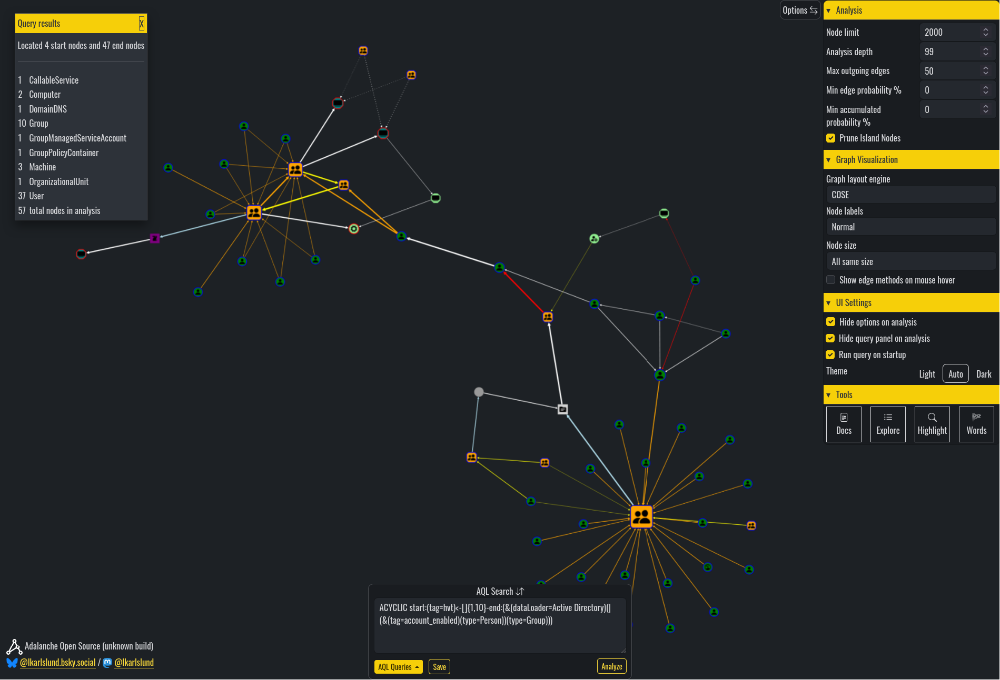
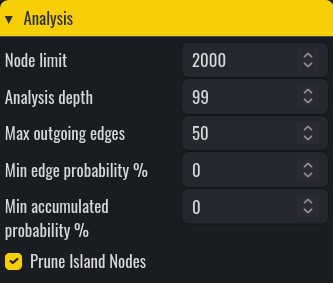
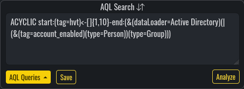
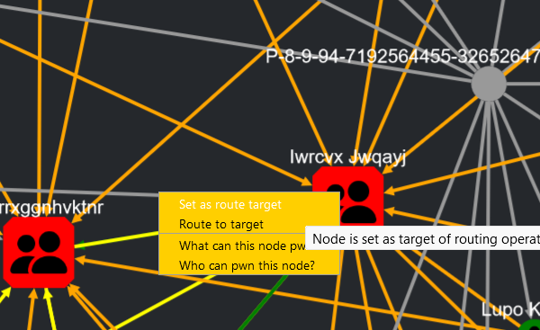
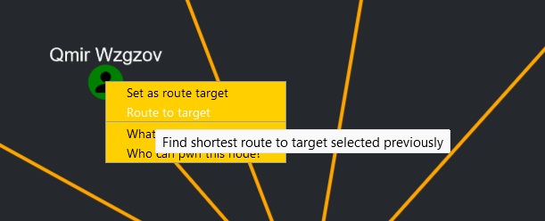
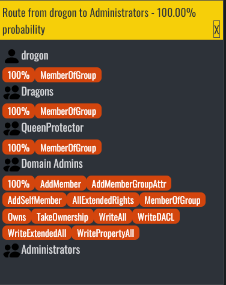

# User Interface

When launched, you will see loaded object/edge statistics and analysis controls.

The default query is intended to show paths toward privileged targets.

## Pre-defined searches

Use the built-in query list in the AQL Search panel.

## Analysis options

### Node limit

Default is 2000. If results exceed this, Adalanche removes some nodes to keep browser performance manageable.

### Max analysis depth

Controls traversal depth. `0` only evaluates initial node filters; `1` includes immediate neighbors.

### Minimum edge probability

Filters out edges below the specified edge probability threshold.

### Minimum accumulated probability

Filters out paths below the specified accumulated probability threshold.

### Prune isolated nodes

Removes nodes with no connecting edges from results.

## AQL Search panel

You can run built-in queries, edit current queries, and save your own user-defined queries.

See [AQL syntax](aql.md#aql-syntax).

## Tagged nodes

Adalanche tags nodes to make quick filtering easier.

| Tag | Description |
| --- | ----------- |
| hvt | High Value Target |
| role_domaincontroller | Domain Controller machines |
| role_readonly_domaincontroller | Read-Only Domain Controller machines |
| role_certificate_authority | Certificate Authority machines |
| laps | Machine is detected as having LAPS deployed |
| kerberoast | Account is kerberoastable |
| asreproast | Account is AS-REP roastable |
| windows | Machine is running Windows |
| linux | Machine is running Linux |
| unconstrained | Account has unconstrained delegation |
| constrained | Account has constrained delegation |
| computer_account | Domain-joined computer account |
| domaincontroller_account | Domain controller account |
| account_disabled | Account is disabled |
| account_enabled | Account is enabled |
| account_locked | Account is locked |
| account_expired | Account is expired |
| account_active | Account is enabled and not expired |
| account_inactive | Account is disabled or expired |
| password_cant_change | Password cannot be changed |
| password_never_expires | Password does not expire |
| password_not_required | Password is not required |

Search by these via the `tag` attribute.

## Edges

Adalanche detects many relationships between nodes and represents them as edges.

This list is not exhaustive; see the full list in the UI.

| Edge | Explanation |
| -------- | ----------- |
| ACLContainsDeny | ACL contains deny entries that may affect interpretation |
| AddMember | Can change group members via `member` |
| AddSelfMember | Can add/remove itself as a member |
| AllExtendedRights | Has all extended rights |
| CertificateEnroll | Can enroll in a certificate template |
| DCReplicationGetChanges | Can replicate non-confidential DC data |
| DCsync | Combined replication rights enabling DCSync |
| GenericAll | Broad control similar to ownership |
| LocalAdminRights | Local admin rights detected from GPO/collector data |
| LocalRDPRights | Can RDP to target |
| MemberOfGroup | Group membership relation |
| Owns | Owns object |
| ReadLAPSPassword | Can read LAPS password |
| ResetPassword | Can reset account password |
| WriteDACL | Can modify DACL |
| WriteSPN | Can modify SPN |

## Plotting a path in the GUI

Right-click target object and set as target:

Then right-click source and route to target:

If a route exists, it is displayed:

