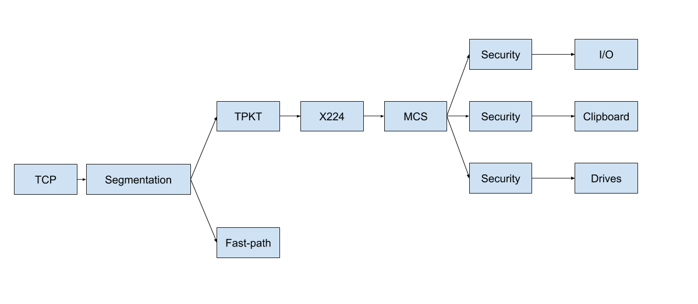

# Layers
## Purpose
Data received from the network passes through a series of layers. The job of a layer is to parse a PDU and forward it to
the next layer in line. Ideally, every single layer would just remove part of the total data received until we're left
with only the data of interest.

```
TCP -> Intermediate Layer 1 (400 bytes) -> Intermediate Layer 2 (380 bytes) -> ... -> Data (250 bytes)
```

Unfortunately, most protocols that are used in RDP are not as simple. For example, most of them have some 
sort of connection PDU type, which cannot be forwarded to the next layer in line. This is especially true for 
the MCS protocol, which has a complex initialization sequence and uses different message types depending on 
whether it is used on a server or a client. In order to handle this complexity, we use layer observers.

## Layer Observers
Each layer can have zero to many `Observer` attached to it. Whenever it receives a PDU, it calls the `Layer` class's 
`pduReceived` method, which notifies the observers and optionally forwards it to the next layer in line.
The job of handling special PDUs is thus left to the layer's observers. This allows us to keep a simple
`parse and forward` design in our layer classes, where forwarding only happens when actual data PDUs are
received.

The clipboard and file stealing logic are implemented using observers. For example, when creating the drive redirection
channel, we simply attach the file stealing observer to the channel and let it do the work.

Observers can be useful if you want to monitor everything that is received. For example, you could attach 
an observer to every layer and record it in a file or log it for debugging.

## Layers in RDP
Here is a diagram of the layers used in RDP:



### TCP
The TCP layer comes first and is simply an adaptor for the backend networking engine. It forwards all data 
and provides a way to start using TLS on the connection, among other things.

### Segmentation
The segmentation layer comes right after TCP and its primary job is to send data to the proper layer for the 
current PDU type. Depending on the PDU's header, it will send data either to the TPKT layer or the fast-path
layer, and send all bytes to this layer until a full PDU has been read. In RDP, two different protocols can be seen as
having a segmentation job: TPKT and fast-path.

TPKT PDUs are very simple: they only have a header, a length and a payload field. Segmentation is their only job.
On the other hand, fast-path is much more complicated: a fast-path PDU contains a length field, which allows it to be used
for segmentation, but it also contains input or output data.

Both of these protocols can be used during the same session. Fast-path is used for quick input and output 
transmissions. TPKT is used for the entire connection sequence as well as more specialized PDUs. It's also 
used for input and output when fast-path is disabled.

### TPKT
As explained in Segmentation, this layer is only used for separating a stream of data into individual 
messages.

### X224 / COTP
This layer receives some of the initial connection information, such as the `mstshash` cookie and the 
protocols to be used during the connection (TLS, CredSSP, etc.). It can also receive disconnection and error 
PDUs. Only Data PDUs are forwarded, the other PDUs should be handled with an observer.

### MCS
By far the most complicated protocol used in RDP, MCS handles communication between different users and 
channels on the same connection (though in practice only one user exists on any individual connection). There
is one channel for every feature / plugin of the protocol: one for input and output, one for the clipboard, 
one for drive mapping, etc.

MCS is where the layer design branches off: there cannot be a single layer after MCS, because the way that
data is handled depends on the channel on which the message was sent. Therefore, it is useless to assign a 
next layer to MCS, since it will never be called. Instead, use an MCSRouter, which is an observer class made 
to handle some of the MCS PDUs.

#### MCS Users
The job of creating users is assigned to the MCS router. Once a user is created, it must be attached. Once
it is attached, channels can finally be joined. In order to create channels, MCS routers use a ChannelFactory.
The ChannelFactory's `buildChannel` method is called with the MCS layer, the user ID and the channel ID.

#### MCS Channels
Each MCS channel should be seen as a separate layer stack that branches off from the MCS layer.

### Security
The security layer handles encryption / decryption and signatures in cases where RDP standard security is 
used. It also handles security headers, which are used even in TLS connections for some of the PDUs.

### I/O (Data)
This is where slow-path RDP data ends up. This layer is also used at the end of the connection sequence.

### Virtual channels (clipboard, drive, etc.)
Virtual channels follow the same route that I/O takes, except their packet structure is different.

### Fast-path
The aptly-named fast-path PDUs contain only the information we care about, so we don't have to deal with MCS.
When enabled (the default setting), fast-path is used to transport input and output information. The PDUs 
themselves are handled as a mix of the TPKT, Security and Data layers: they are used for segmentation, have
encryption / decryption information and contain the actual data of interest.

### Generic Conference Control (GCC / T.124)
This is technically not really a layer, but this protocol is used during the connection phase. The MCS 
Connect Initial PDU's payload a is GCC Create Conference Request, which contains some RDP information.